Fatos Básicos
-------------

Para começar, vamos considerar alguns fatos básicos sobre o conjunto de
dados que está no arquivo `vinhos.csv`.

### Números de Observações

Nesse conjunto, tem dados para vinhos tintos e brancos. Então algumas
informações básicas sobre esse data set são as seguintes:

-   Número de observações relacionadas com vinhos tintos;
-   Número de observações relacionadas com vinhos brancos;
-   Número total de observações.

Esses valores são dados na tabela abaixo.

<table>
<thead>
<tr class="header">
<th style="text-align: center;">Tipo</th>
<th style="text-align: center;">Observações</th>
</tr>
</thead>
<tbody>
<tr class="odd">
<td style="text-align: center;">Tinto</td>
<td style="text-align: center;">1599</td>
</tr>
<tr class="even">
<td style="text-align: center;">Branco</td>
<td style="text-align: center;">4898</td>
</tr>
<tr class="odd">
<td style="text-align: center;">Todos</td>
<td style="text-align: center;">6497</td>
</tr>
</tbody>
</table>

Perceba que o número total de observações apresentado no site da UCI é
menor. Naquela página, são contabilizadas apenas as observações
relacionadas com os vinhos brancos.

### Missing Values

Os pesquisadores que compilaram os dados afirmaram que este data set não
possui valores faltando. É uma boa ideia confirmar que essa afirmação é
verdadeira. A quantidade de missing values para cada coluna do conjunto
de dados pode ser vista na próxima tabela.

<table>
<thead>
<tr class="header">
<th style="text-align: center;">Coluna</th>
<th style="text-align: center;">Missing Values</th>
</tr>
</thead>
<tbody>
<tr class="odd">
<td style="text-align: center;">fixed.acidity</td>
<td style="text-align: center;">0</td>
</tr>
<tr class="even">
<td style="text-align: center;">volatile.acidity</td>
<td style="text-align: center;">0</td>
</tr>
<tr class="odd">
<td style="text-align: center;">citric.acid</td>
<td style="text-align: center;">0</td>
</tr>
<tr class="even">
<td style="text-align: center;">residual.sugar</td>
<td style="text-align: center;">0</td>
</tr>
<tr class="odd">
<td style="text-align: center;">chlorides</td>
<td style="text-align: center;">0</td>
</tr>
<tr class="even">
<td style="text-align: center;">free.sulfur.dioxide</td>
<td style="text-align: center;">0</td>
</tr>
<tr class="odd">
<td style="text-align: center;">total.sulfur.dioxide</td>
<td style="text-align: center;">0</td>
</tr>
<tr class="even">
<td style="text-align: center;">density</td>
<td style="text-align: center;">0</td>
</tr>
<tr class="odd">
<td style="text-align: center;">ph</td>
<td style="text-align: center;">0</td>
</tr>
<tr class="even">
<td style="text-align: center;">sulphates</td>
<td style="text-align: center;">0</td>
</tr>
<tr class="odd">
<td style="text-align: center;">alcohol</td>
<td style="text-align: center;">0</td>
</tr>
<tr class="even">
<td style="text-align: center;">quality</td>
<td style="text-align: center;">0</td>
</tr>
</tbody>
</table>

### Distribuição dos Dados

Para cada vinho no conjunto de dados, há 11 medidas associadas com as
propriedades químicas da bebida. É importante analisar a distribuição de
cada uma dessas variáveis numéricas. Então começamos calculando as
seguintes quantidades para cada variável:

-   Valor mínimo;
-   Primeiro quartil;
-   Mediana;
-   Média;
-   Terceiro quartil;
-   Valor máximo.

Por uma questão de conveniência, os dados para os vinhos tintos foram
combinados com os dados para os vinhos brancos. Essas bebidas têm
características semelhantes, mas elas são diferentes e devem ser
consideradas separadamente. Então primeiro apresentamos os resultados
para os vinhos tintos e depois aqueles para os vinhos brancos. Os
resultados que obtivemos estão organizados nas tabelas que seguem.

Resultados para os vinhos tintos:

<table>
<thead>
<tr class="header">
<th style="text-align: center;">Variável</th>
<th style="text-align: center;">Mínimo</th>
<th style="text-align: center;">Primeiro quartil</th>
<th style="text-align: center;">Mediana</th>
<th style="text-align: center;">Média</th>
<th style="text-align: center;">Terceiro quartil</th>
<th style="text-align: center;">Máximo</th>
</tr>
</thead>
<tbody>
<tr class="odd">
<td style="text-align: center;">fixed.acidity</td>
<td style="text-align: center;">4.60000</td>
<td style="text-align: center;">7.1000</td>
<td style="text-align: center;">7.90000</td>
<td style="text-align: center;">8.3196373</td>
<td style="text-align: center;">9.200000</td>
<td style="text-align: center;">15.90000</td>
</tr>
<tr class="even">
<td style="text-align: center;">volatile.acidity</td>
<td style="text-align: center;">0.12000</td>
<td style="text-align: center;">0.3900</td>
<td style="text-align: center;">0.52000</td>
<td style="text-align: center;">0.5278205</td>
<td style="text-align: center;">0.640000</td>
<td style="text-align: center;">1.58000</td>
</tr>
<tr class="odd">
<td style="text-align: center;">citric.acid</td>
<td style="text-align: center;">0.00000</td>
<td style="text-align: center;">0.0900</td>
<td style="text-align: center;">0.26000</td>
<td style="text-align: center;">0.2709756</td>
<td style="text-align: center;">0.420000</td>
<td style="text-align: center;">1.00000</td>
</tr>
<tr class="even">
<td style="text-align: center;">residual.sugar</td>
<td style="text-align: center;">0.90000</td>
<td style="text-align: center;">1.9000</td>
<td style="text-align: center;">2.20000</td>
<td style="text-align: center;">2.5388055</td>
<td style="text-align: center;">2.600000</td>
<td style="text-align: center;">15.50000</td>
</tr>
<tr class="odd">
<td style="text-align: center;">chlorides</td>
<td style="text-align: center;">0.01200</td>
<td style="text-align: center;">0.0700</td>
<td style="text-align: center;">0.07900</td>
<td style="text-align: center;">0.0874665</td>
<td style="text-align: center;">0.090000</td>
<td style="text-align: center;">0.61100</td>
</tr>
<tr class="even">
<td style="text-align: center;">free.sulfur.dioxide</td>
<td style="text-align: center;">1.00000</td>
<td style="text-align: center;">7.0000</td>
<td style="text-align: center;">14.00000</td>
<td style="text-align: center;">15.8749218</td>
<td style="text-align: center;">21.000000</td>
<td style="text-align: center;">72.00000</td>
</tr>
<tr class="odd">
<td style="text-align: center;">total.sulfur.dioxide</td>
<td style="text-align: center;">6.00000</td>
<td style="text-align: center;">22.0000</td>
<td style="text-align: center;">38.00000</td>
<td style="text-align: center;">46.4677924</td>
<td style="text-align: center;">62.000000</td>
<td style="text-align: center;">289.00000</td>
</tr>
<tr class="even">
<td style="text-align: center;">density</td>
<td style="text-align: center;">0.99007</td>
<td style="text-align: center;">0.9956</td>
<td style="text-align: center;">0.99675</td>
<td style="text-align: center;">0.9967467</td>
<td style="text-align: center;">0.997835</td>
<td style="text-align: center;">1.00369</td>
</tr>
<tr class="odd">
<td style="text-align: center;">ph</td>
<td style="text-align: center;">2.74000</td>
<td style="text-align: center;">3.2100</td>
<td style="text-align: center;">3.31000</td>
<td style="text-align: center;">3.3111132</td>
<td style="text-align: center;">3.400000</td>
<td style="text-align: center;">4.01000</td>
</tr>
<tr class="even">
<td style="text-align: center;">sulphates</td>
<td style="text-align: center;">0.33000</td>
<td style="text-align: center;">0.5500</td>
<td style="text-align: center;">0.62000</td>
<td style="text-align: center;">0.6581488</td>
<td style="text-align: center;">0.730000</td>
<td style="text-align: center;">2.00000</td>
</tr>
<tr class="odd">
<td style="text-align: center;">alcohol</td>
<td style="text-align: center;">8.40000</td>
<td style="text-align: center;">9.5000</td>
<td style="text-align: center;">10.20000</td>
<td style="text-align: center;">10.4229831</td>
<td style="text-align: center;">11.100000</td>
<td style="text-align: center;">14.90000</td>
</tr>
</tbody>
</table>

Resultados para os vinhos brancos:

<table style="width:100%;">
<colgroup>
<col style="width: 21%" />
<col style="width: 8%" />
<col style="width: 17%" />
<col style="width: 10%" />
<col style="width: 12%" />
<col style="width: 17%" />
<col style="width: 10%" />
</colgroup>
<thead>
<tr class="header">
<th style="text-align: center;">Variável</th>
<th style="text-align: center;">Mínimo</th>
<th style="text-align: center;">Primeiro quartil</th>
<th style="text-align: center;">Mediana</th>
<th style="text-align: center;">Média</th>
<th style="text-align: center;">Terceiro quartil</th>
<th style="text-align: center;">Máximo</th>
</tr>
</thead>
<tbody>
<tr class="odd">
<td style="text-align: center;">fixed.acidity</td>
<td style="text-align: center;">3.80000</td>
<td style="text-align: center;">6.3000000</td>
<td style="text-align: center;">6.80000</td>
<td style="text-align: center;">6.8547877</td>
<td style="text-align: center;">7.3000</td>
<td style="text-align: center;">14.20000</td>
</tr>
<tr class="even">
<td style="text-align: center;">volatile.acidity</td>
<td style="text-align: center;">0.08000</td>
<td style="text-align: center;">0.2100000</td>
<td style="text-align: center;">0.26000</td>
<td style="text-align: center;">0.2782411</td>
<td style="text-align: center;">0.3200</td>
<td style="text-align: center;">1.10000</td>
</tr>
<tr class="odd">
<td style="text-align: center;">citric.acid</td>
<td style="text-align: center;">0.00000</td>
<td style="text-align: center;">0.2700000</td>
<td style="text-align: center;">0.32000</td>
<td style="text-align: center;">0.3341915</td>
<td style="text-align: center;">0.3900</td>
<td style="text-align: center;">1.66000</td>
</tr>
<tr class="even">
<td style="text-align: center;">residual.sugar</td>
<td style="text-align: center;">0.60000</td>
<td style="text-align: center;">1.7000000</td>
<td style="text-align: center;">5.20000</td>
<td style="text-align: center;">6.3914149</td>
<td style="text-align: center;">9.9000</td>
<td style="text-align: center;">65.80000</td>
</tr>
<tr class="odd">
<td style="text-align: center;">chlorides</td>
<td style="text-align: center;">0.00900</td>
<td style="text-align: center;">0.0360000</td>
<td style="text-align: center;">0.04300</td>
<td style="text-align: center;">0.0457724</td>
<td style="text-align: center;">0.0500</td>
<td style="text-align: center;">0.34600</td>
</tr>
<tr class="even">
<td style="text-align: center;">free.sulfur.dioxide</td>
<td style="text-align: center;">2.00000</td>
<td style="text-align: center;">23.0000000</td>
<td style="text-align: center;">34.00000</td>
<td style="text-align: center;">35.3080849</td>
<td style="text-align: center;">46.0000</td>
<td style="text-align: center;">289.00000</td>
</tr>
<tr class="odd">
<td style="text-align: center;">total.sulfur.dioxide</td>
<td style="text-align: center;">9.00000</td>
<td style="text-align: center;">108.0000000</td>
<td style="text-align: center;">134.00000</td>
<td style="text-align: center;">138.3606574</td>
<td style="text-align: center;">167.0000</td>
<td style="text-align: center;">440.00000</td>
</tr>
<tr class="even">
<td style="text-align: center;">density</td>
<td style="text-align: center;">0.98711</td>
<td style="text-align: center;">0.9917225</td>
<td style="text-align: center;">0.99374</td>
<td style="text-align: center;">0.9940274</td>
<td style="text-align: center;">0.9961</td>
<td style="text-align: center;">1.03898</td>
</tr>
<tr class="odd">
<td style="text-align: center;">ph</td>
<td style="text-align: center;">2.72000</td>
<td style="text-align: center;">3.0900000</td>
<td style="text-align: center;">3.18000</td>
<td style="text-align: center;">3.1882666</td>
<td style="text-align: center;">3.2800</td>
<td style="text-align: center;">3.82000</td>
</tr>
<tr class="even">
<td style="text-align: center;">sulphates</td>
<td style="text-align: center;">0.22000</td>
<td style="text-align: center;">0.4100000</td>
<td style="text-align: center;">0.47000</td>
<td style="text-align: center;">0.4898469</td>
<td style="text-align: center;">0.5500</td>
<td style="text-align: center;">1.08000</td>
</tr>
<tr class="odd">
<td style="text-align: center;">alcohol</td>
<td style="text-align: center;">8.00000</td>
<td style="text-align: center;">9.5000000</td>
<td style="text-align: center;">10.40000</td>
<td style="text-align: center;">10.5142670</td>
<td style="text-align: center;">11.4000</td>
<td style="text-align: center;">14.20000</td>
</tr>
</tbody>
</table>

#### Boxplots

Não é tão simples ganhar um entendimento sobre a distribuição dos dados
apenas olhando para as tabelas acima. Sendo assim, na sequência
consideramos algumas maneiras de visualizar essa distribuição. Primeiro,
criamos uma série de boxplots. Esse passo é interessante, pois os
autores que compilaram este conjunto de dados afirmaram que nele há uma
grande quantidade de outliers. Queremos confirmar que essa afirmação é
verdadeira visualizando os diagramas de caixa.

Para cada característica do vinho, criamos um par de diagramas. Um deles
representa a distribuição dos dados para os vinhos tintos e o outro
corresponde aos vinhos brancos.

**Boxplot da variável na coluna `fixed.acidity`:**

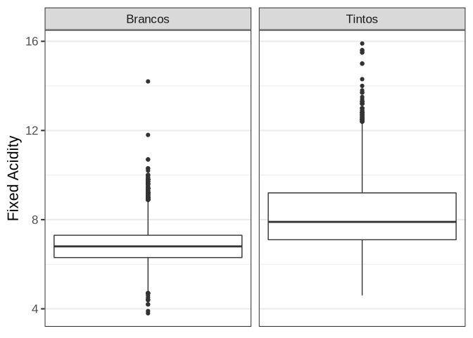

**Boxplot da variável na coluna `volatile.acidity`:**

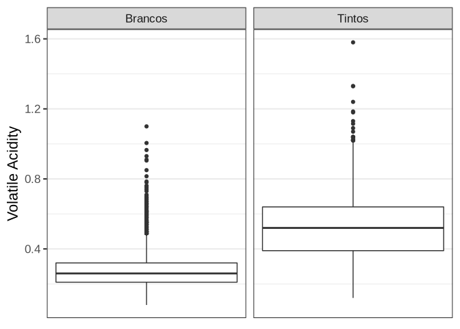

**Boxplot da variável na coluna `citric.acid`:**

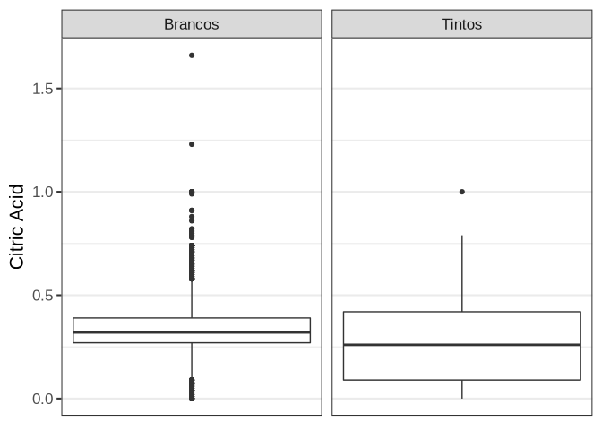

**Boxplot da variável na coluna `residual.sugar`:**

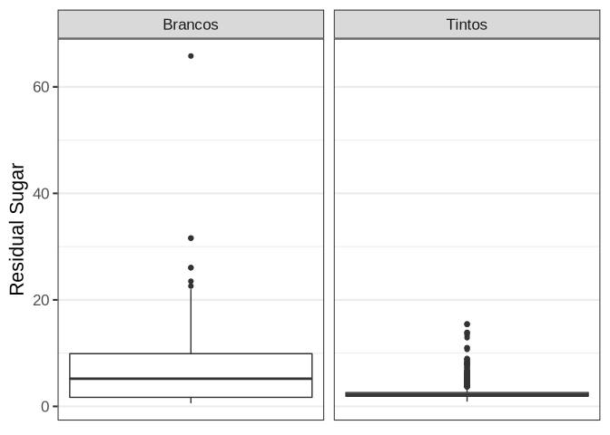

**Boxplot da variável na coluna `chlorides`:**

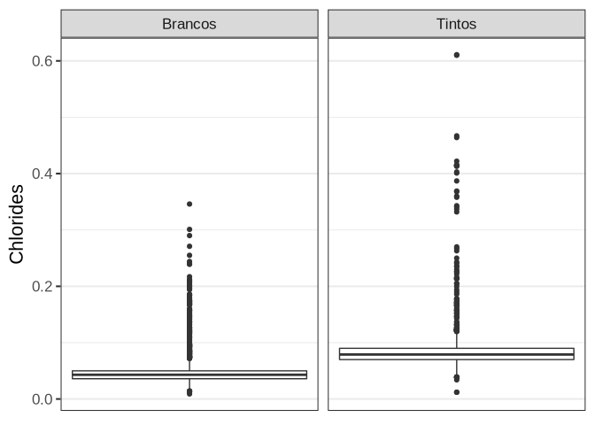

**Boxplot da variável na coluna `free.sulfur.dioxide`:**

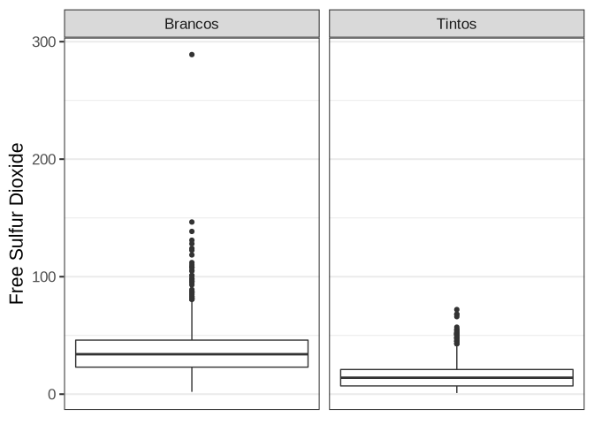

**Boxplot da variável na coluna `total.sulfur.dioxide`:**

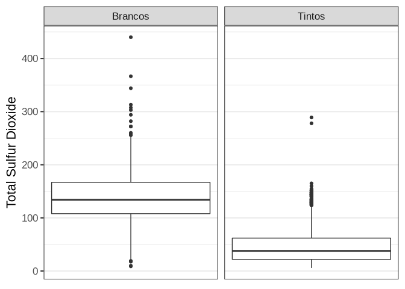

**Boxplot da variável na coluna `density`:**

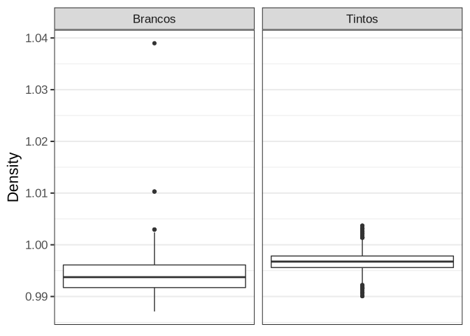

**Boxplot da variável na coluna `ph`:**

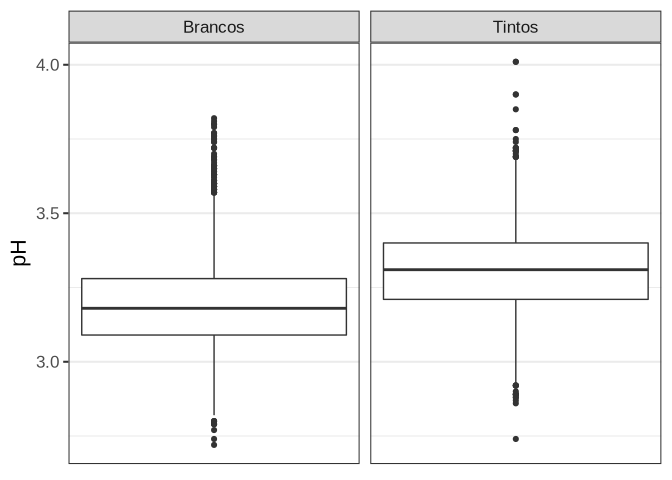

**Boxplot da variável na coluna `sulphates`:**

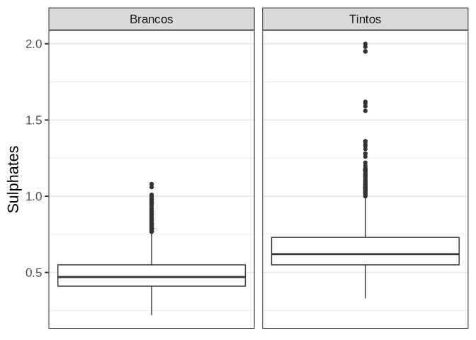

**Boxplot da variável na coluna `alcohol`:**

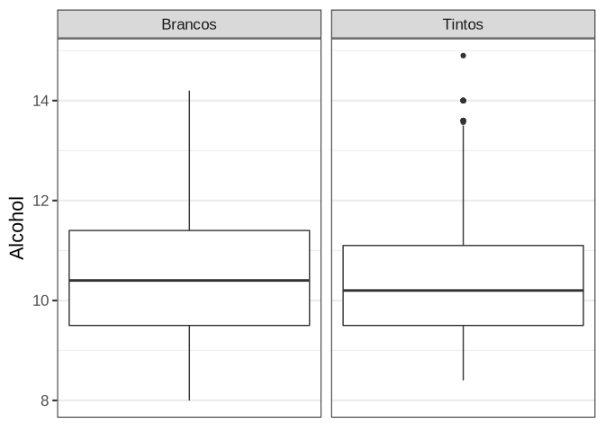
